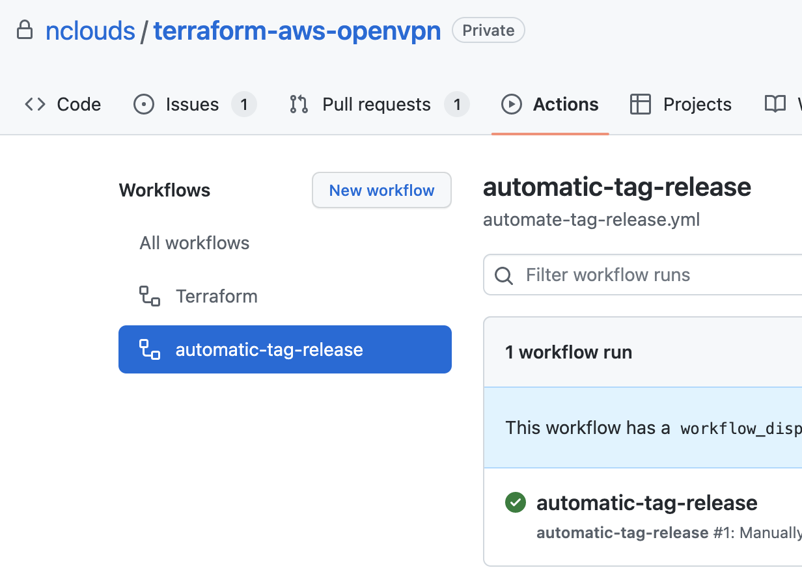
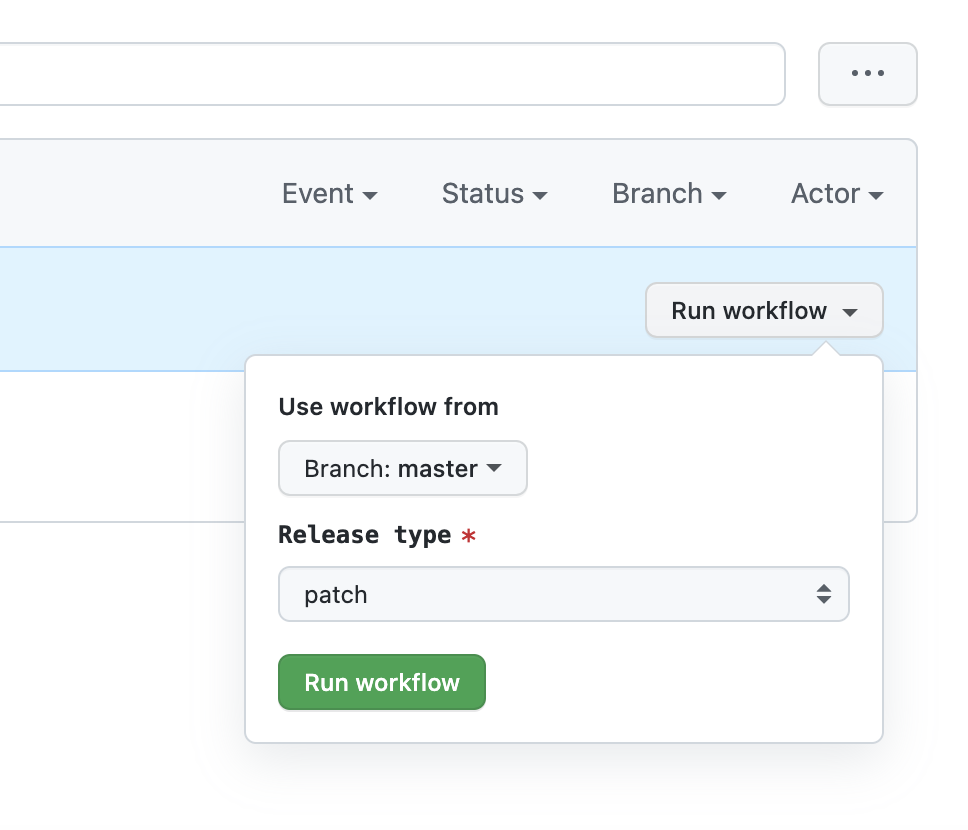

# Releasing a new version of the module

After a developer's code is merged into master branch, it's time to crate a change-log and release a new version of the module. 

The process to create a new `Release Tag` and `Changelog` is `semi-automatic`. By `semi-automatic` we mean that the workflow is `automatic` but needs to be triggered manually via `Github` Actions on each module repository.

Below steps provide details on how to create a new release tag and change log for a module

1. Go to the `Automatc Tag Release` in `Github Actions`.

    

2. Click on `Run Workflow`
    1. Choose `Branch` (Default is `master` and must be kept as it is).
    2. Choose `Release Type` according to what kind of `tag` you want to bump.
        By Default, the automation bumps a `patch` version. 
        If you want to bump a minor or `major` version, you need to choose the relevant `Release Type`
        - `Minor` Version Upgrade ⇒ e.g  **x.1.y ⇒ x.2.0** **(Default Behaviour**
        - `Major` Version Upgrade ⇒ e.g  **1.x.y ⇒ 2.0.0**
        - `Patch` Version Upgrade ⇒ e.g  **x.y.1 ⇒ x.y.2**
    
3. Click on `Run Workflow`

**_NOTE:_** 
- ChangeLog template is stored within `.chglog` directory.
- Changelog creation is automated and if you have followed Semantic PR correctly, the ChangeLog (`CHANGELOG.md`) automatically.

TODO: document install of `semtag` and `git-chglog` that are needed for admins to release new versions.
